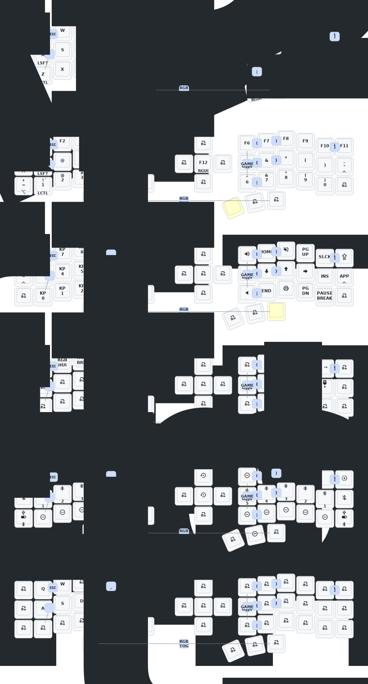

# Eyelash Corne ZMK config

[English](README.md) | **Русский**

Персональная конфигурация ZMK для беспроводной split-клавиатуры
**Eyelash Corne**. Раскладка перенесена с Jorne и адаптирована для macOS,
встроенного пятипозиционного джойстика и игр в CS2.

> [!IMPORTANT]
> Это не стандартный Corne от foostan. Для этой клавиатуры нужна прошивка
> `eyelash_corne`; стандартная прошивка `corne` несовместима.

## Раскладка

Схема автоматически генерируется
[Keymap Drawer](https://github.com/caksoylar/keymap-drawer) после каждого
изменения файла `config/eyelash_corne.keymap`.

[](keymap-drawer/eyelash_corne.svg)

## Слои

| Слой | Как включить | Назначение |
| --- | --- | --- |
| `MAIN` | Основной слой | Набор текста и управление джойстиком |
| `SYMBOLS` | Удерживать правый `Enter` | Символы, цифры и функциональные клавиши |
| `NUMBERS` | Удерживать правый `Del` | Numpad, навигация и системные клавиши |
| `MOUSE` | Удерживать левый `Esc` | Мышь, прокрутка и управление RGB |
| `ADJUST` | `Q + P + нажатие джойстика` | Bluetooth, USB, reset, bootloader и ZMK Studio |
| `GAME` | `Y + H + N` | Игровая раскладка для левой половины |
| `GAME UTIL` | Удерживать средний левый thumb на `GAME` | Выбор оружия `1–5` |

Layer-tap клавиши выполняют обычное действие при коротком нажатии и включают
слой при удержании. Например:

```dts
&lt SYMBOLS ENTER
```

Короткое нажатие отправляет `Enter`, удержание включает `SYMBOLS`.

## Combo

Combo срабатывает при одновременном нажатии указанных клавиш.

| Клавиши | Результат |
| --- | --- |
| `Q + W` | `Esc` |
| `Y + U` | `(` |
| `U + I` | `)` |
| `H + J` | `{` |
| `J + K` | `}` |
| `N + M` | `\|` |
| `M + ,` | `[` |
| `, + .` | `]` |
| `R + T` | `_` |
| `Y + H + N` | Включить или выключить `GAME` |
| `Q + P + джойстик` | Включить или выключить `ADJUST` |
| Крайние thumb-клавиши | Включить или выключить RGB |
| `Q + S + Z` (удерживать 2 секунды) | Глубокий сон |

При стандартной русской раскладке macOS HID-клавиша `[` вводит `х`, а `]`
вводит `ъ`.

## Джойстик и мышь

На основном слое пятипозиционный джойстик правой половины работает как мышь:

- направления двигают курсор;
- нажатие выполняет левый клик.

На других слоях прозрачные позиции наследуют это поведение, но отдельные
служебные назначения могут его перекрывать.

На слое `MOUSE`:

- `H/J/K/L` двигают курсор в стиле Vim: влево, вниз, вверх, вправо;
- верхний правый ряд управляет прокруткой;
- `Q/W` меняют оттенок RGB;
- `E/R` уменьшают и увеличивают яркость;
- `T` переключает эффект RGB.

Настройки RGB сохраняются во flash-памяти.

## Игровой слой

`GAME` рассчитан на CS2 и использование только левой половины:

| Физическая клавиша | Отправляемая клавиша |
| --- | --- |
| `E/S/D/F` | `W/A/S/D` |
| `A` | `Left Shift` (ходьба) |
| `Z` | `Left Ctrl` (приседание) |
| Бывшая позиция `Ctrl` | `Z` |
| Три thumb-клавиши слева направо | `Space`, удержание `GAME UTIL`, `Esc` |

На `GAME UTIL` физические `Q/W/E/R/T` отправляют `1/2/3/4/5`.

## Служебный слой

`ADJUST` намеренно включается сложным combo, чтобы избежать случайного сброса:

- `BT_SEL 0–4` выбирает Bluetooth-профиль;
- `BT_CLR` удаляет текущее Bluetooth-соединение;
- `OUT_TOG` переключает USB/Bluetooth;
- `studio_unlock` разрешает изменение раскладки через ZMK Studio;
- `sys_reset` перезагружает контроллер;
- `bootloader` переводит контроллер в режим прошивки.

Повторное нажатие `Q + P + джойстик` выключает `ADJUST`.

## Сборка

Прошивка автоматически собирается в
[GitHub Actions](https://github.com/wyarniko/corne-zmk-config/actions/workflows/build.yml)
после каждого push.
Готовый artifact `firmware` содержит:

- `eyelash_corne_studio_left.uf2` — левая центральная половина;
- `eyelash_corne_right nice_view-nice_nano_v2-zmk.uf2` — правая половина;
- `settings_reset-nice_nano_v2-zmk.uf2` — очистка сохранённых настроек.

## Прошивка

1. Подключить нужную половину по USB.
2. Дважды быстро нажать физическую кнопку Reset.
3. Дождаться появления диска `NICENANO`.
4. Скопировать соответствующий `.uf2` в корень диска.
5. Повторить для второй половины.
6. Включить обе половины и одновременно однократно нажать Reset.

`settings_reset` нужен только при проблемах с Bluetooth или соединением половин.
После него необходимо снова прошить обычный left/right UF2.

## Основные файлы

- [`config/eyelash_corne.keymap`](config/eyelash_corne.keymap) — раскладка,
  слои и combo;
- [`config/eyelash_corne.conf`](config/eyelash_corne.conf) — функции ZMK;
- [`build.yaml`](build.yaml) — варианты собираемой прошивки;
- [`config/west.yml`](config/west.yml) — ZMK и внешние модули;
- [`boards/shields/eyelash_corne`](boards/shields/eyelash_corne) — аппаратное
  описание клавиатуры.

Аппаратная поддержка основана на
[a741725193/zmk-new_corne](https://github.com/a741725193/zmk-new_corne).
